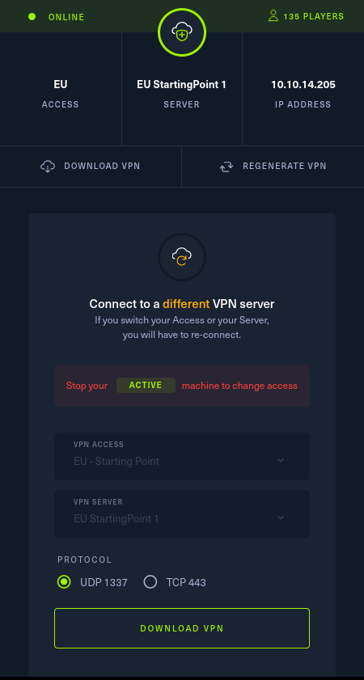

[](https://github.com/robertoschiavone/crocodile/actions/workflows/docker-image.yml)

# crocodile

## Setup

1) Download the OpenVPN config from HackTheBox and place it inside this folder



2) Rename it to `client.ovpn`

3) Build the images with the following commands:

```
docker build -f images/crocodile/Dockerfile -t crocodile .
docker build -f images/openvpn/Dockerfile -t openvpn .
```

## Usage

1) Start the OpenVPN client instance

```
docker run --rm --privileged --sysctl net.ipv6.conf.all.disable_ipv6=0 \
    --cap-add NET_ADMIN --device=/dev/net/tun --name=openvpn openvpn
```

2) Access the Internet through the VPN using the `crocodile` image

  - You can either launch a program from the image

```
docker run --rm -it --net=container:openvpn crocodile tmux
```

  - Or check if a challenge has an available solution

```
docker run --rm -it --net=container:openvpn --env HTB_TARGET_IP=10.x.x.x \
    --env HTB_CHALLENGE=meow crocodile
```

